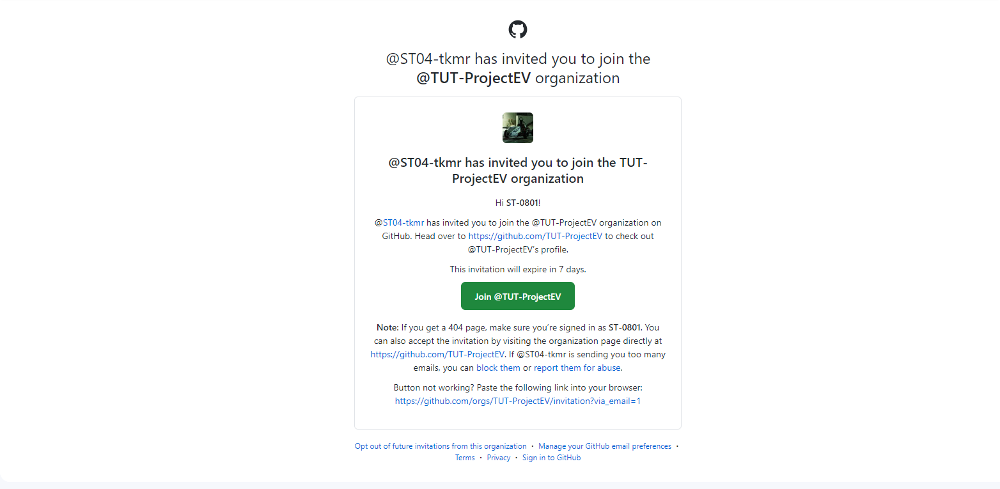
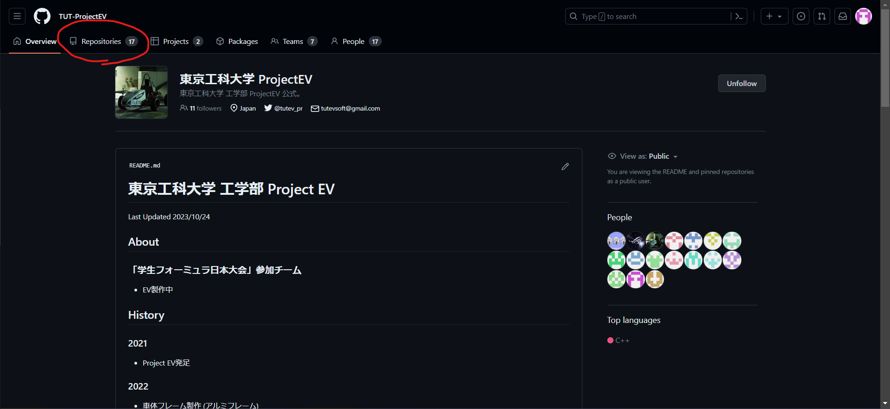
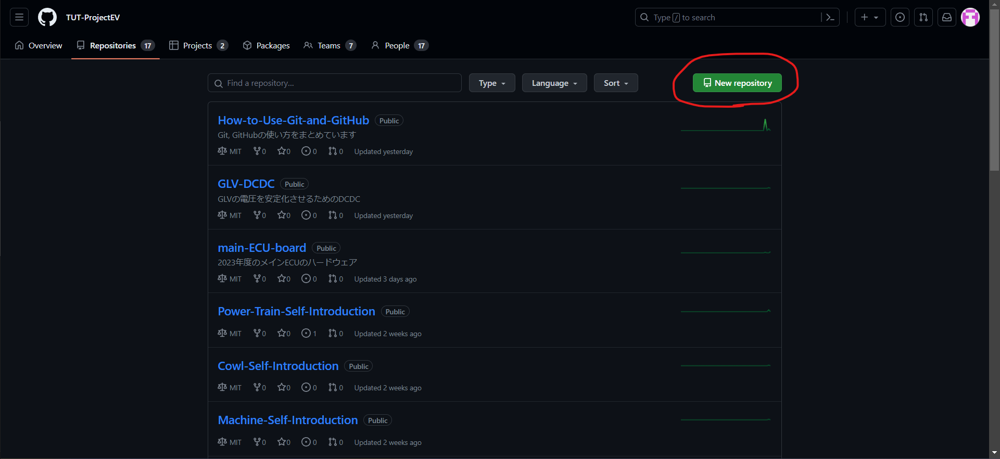
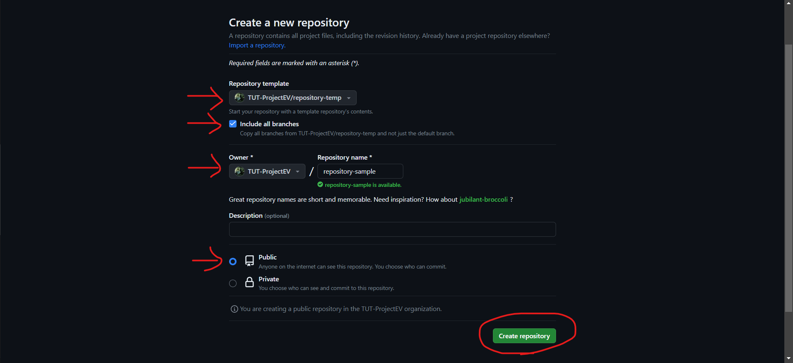
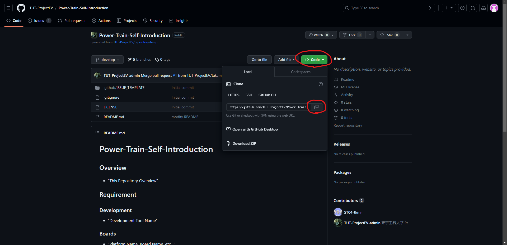
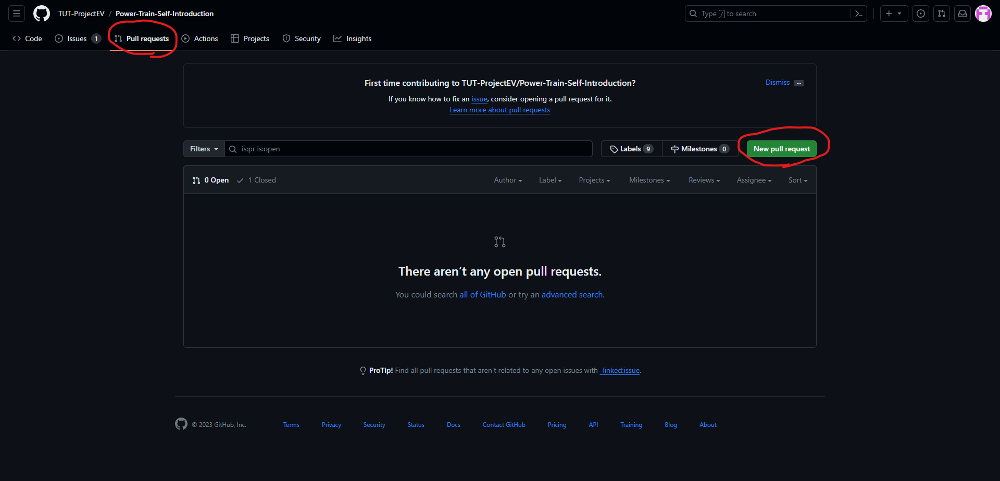
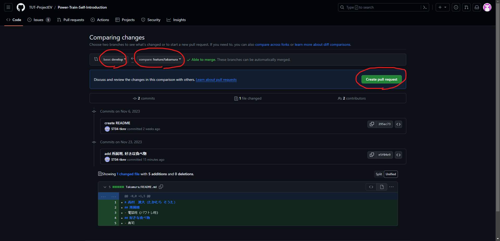
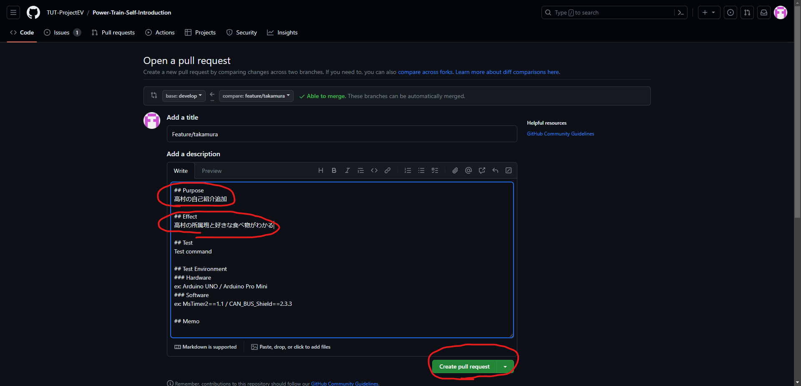

# Git GitHub Tutorial 2

## About
- チーム開発のチュートリアル
- チームアカウント(Organization)へのアクセス、アプローチの仕方
- チームのリポジトリでの作業の流れ

## Description
- Gitのインストールと初期設定 [^1] 、GitHubアカウントの作成 [^2] まで完了しているものとする
- チュートリアルでやること
    - 各班の自己紹介リポジトリ (作成済み) に自分の自己紹介を追加
    - 自分の名前のディレクトリを作成し、その下に 'README.md' ファイルを置く
    - 今回編集するファイルには、__外部に公開したくない情報は書かないで!__

## Organizationへの参加
- チームのアカウントをGitHubでは 'Organization' として扱う
- `Organization` のリポジトリにアクセスし、開発を行っていくには `Organization` の管理者に招待してもらい、参加する必要がある
1. [TUT-ProjectEV](https://github.com/TUT-ProjectEV) の管理者にユーザーネームを伝え、招待してもらう
2. 自身のGitHubアカウントに設定したメールアドレス宛に招待メールが届くので、 `Join @TUT-ProjectEV` をクリック

3. webページに飛ばされるので、 `Join 東京工科大学 ProjectEV` をクリック
4. 参加完了

## GitHubを使用したチーム開発におけるルール
- [Project EV rules](https://github.com/TUT-ProjectEV/.github-private/tree/develop/profile) 参照

## リモートリポジトリ作成
- 自己紹介リポジトリは作成済みなので、ここはスキップでOK
    - 今後の使い方の参考までに書いておく
1. [TUT-ProjectEV](https://github.com/TUT-ProjectEV) へアクセス
2. 画面上部 `Repositories` タブをクリック

3. 画面右上 `New repository` をクリック

4. `Repository template` を `No template` から `TUT-ProjectEV/repository-temp` へ変更
5. `Include all branches` にチェックを入れる
6. `Repository name` を入力
7. `Private` から `Public` に変更
> [!WARNING]
> 企業の部外秘の情報など含まれる場合は 'Private' のままにしておくこと
8. `Create repository` をクリックしてリポジトリ作成完了


## リモートリポジトリをローカルにクローン
- Gitのコマンドで説明していくが、GitHub Desktopを使用して行うことも可能 [^3]
- ここでは、自分が所属する班の自己紹介リポジトリをクローンする
1. コマンドプロンプトを開く
2. リポジトリをクローンしたい場所に移動 [^4]
```
cd "移動先ディレクトリのパス"
```
3. リポジトリをクローン [^4]
```
git clone "リモートリポジトリのURL"
```
- パワトレ班の自己紹介リポジトリをデスクトップにクローンする場合
```
コマンドプロンプトを開き、以下を実行
cd Desktop
git clone https://github.com/TUT-ProjectEV/Power-Train-Self-Introduction.git
```
- リポジトリのURLの確認方法
    - GitHubでクローンしたいリポジトリにアクセスし、緑色の `Code` をクリック
    - 出てきた小ウィンドウ内で、ワンクリックでURLをコピーできる


## 自分の作業ブランチ作成
- ローカルリポジトリで作業を始めるときは毎回この手順を踏むこと
- `develop` ブランチには常に正常動作するものを置いておくための手順
1. 作業を行うリポジトリに移動 [^4]
```
cd "リポジトリのパス"
```
2. 現在のブランチを確認
```
git branch
```
3. `develop` ブランチに入る (すでに入っている場合はスキップ)
```
git checkout develop
```
4. リモートリポジトリで `develop` ブランチの更新があるか確認
```
git pull
```
5. `feature/xxx` ブランチを切る (`xxx` は適宜読み替え)
    - 今回は自分の名前のフォルダを作ってそこに `README.md` を置くので、 `feature/"名前 (半角アルファベット)` というブランチを作成
```
git checkout -b feature/xxx
```
6. `feature/xxx` ブランチで開発

## 自己紹介ファイルの作成・編集
1. エクスプローラーを開く
2. 自己紹介リポジトリに移動
3. 新規作成から自分の名前のフォルダを作成し、そのフォルダに入る 
4. 右クリック>新規作成>テキストドキュメントをクリックし、ファイル名を `README.md` にして作成
    - ファイル名の拡張子も `.txt` から `.md` に変更すること
5. `README.md` を開き、編集・保存 (メモ帳でも何でも良い)
- 以下、一例です
  - Markdown方式で記述することをおすすめします [^5]
```
# 高村 漱大 (たかむら そうた)
## 所属班
- 電装班 (パワトレ班)
## 好きな食べ物
- 寿司
```
- 作業後のフォルダの中身はこんな感じ
  - パワトレ班・高村の場合
```
Power-Train-Self-Introduction
├─ .github
├─ Takamura
│   └─ README.md
├─ .gitignore
├─ LICENSE
└─ README.md
```
> [!NOTE]
> エクスプローラー内でファイル拡張子を表示する設定にしておかないと、正しく `README` が表示されません

## ローカルリポジトリにコミット
1. 追加・変更したファイルを指定 [^4]
```
git add "ファイルのパス"
```
2. コミット (追加・変更を保存)
    - ここは "" が必要なので注意
```
git commit -m "コミットメッセージ"
```

## リモートリポジトリにプッシュ
1. リモートリポジトリに追加・変更を反映させる
```
git push origin feture/xxx
```
2. GitHubでリモートリポジトリの中身を確認すると、反映されているのがわかる
    - `feature/xxx` ブランチに切り替えて確認しよう

## プルリクエスト作成
- `develop` ブランチに反映させるには、プルリクエストを作成してレビューをしてもらい、マージさせる必要がある
1. ブラウザからチームのGitHubにアクセスし、追加・変更を加えたリポジトリにアクセスする
2. `Pull request` タブをクリック
3. `New pull request` をクリック

4. マージ先 `develop` ブランチと自分が作業した `feature/xxx` ブランチを設定し、 `Create pull request` をクリック

5. テンプレートが出来上がっているので、必要事項を記入し、 `Create pull request` をクリック
    - 今回は `Purpose` と `Effect` ぐらいの記入で大丈夫

6. 現時点では `Review required` , `Merging is blocked` と表示され、 `develop` ブランチにはマージできない

## プルリクエスト承認
- プルリクを作成したら自分以外の誰かに承認をもらわなければならない
- 以下、承認を出す手順
1. `Pull request` タブから、該当プルリクを確認
2. `Files changed` タブをクリック
3. 追加・変更のチェック
4. 問題なければ、 `Review changes` をクリックし、必要に応じてコメントを記入し、 `Approve` にチェックを入れ、 `Submit review` をクリック
    - コメントしたいだけなら `Comment` にチェック、変更してほしい箇所があるなら `Request changes` にチェックする

## `develop` ブランチにマージ
1. プルリクエストが承認され、 `develop` ブランチへのマージが可能になったら、 `Merge pull request` をクリック
2. マージが完了したら、 `Delete branch` をクリックし、 `feature/xxx` ブランチは削除する

## Well done!
- GitHubで自分のディレクトリに入ってみましょう
- うまくいっていれば、`README` が表示され、ちょっとしたサイトのようになっているはずです
- わからないことがあれば、このリポジトリの `Discussions` の `Q&A` などに投げてみてください

[^1]: [Gitのインストールと初期設定手順](./../Git-settings/)
[^2]: [GitHubアカウント作成手順](./../GitHub-creating-account/)
[^3]: [GitHub Desktopの基本](./../../GitHubDesktop-basic/)
[^4]: "" の部分は各自読み替え ("" は不要)
[^5]: Markdown方式の書き方は [こちら](https://docs.github.com/ja/get-started/writing-on-github/getting-started-with-writing-and-formatting-on-github/basic-writing-and-formatting-syntax)